# Aitor_Skills

<p align="center">
  
</p>

<p align="center">
  <b>Personal skill library for Codex / Claude Code.</b><br />
  A living repo of tools, workflows, and experiments.
</p>

<p align="center">
  <a href="https://github.com/rm2thaddeus/Aitor_Skills"></a>
  
  
</p>

---

## What this is

This repository holds my personal skill set, stored in `SKILL.md` files plus supporting assets and scripts. It's designed to evolve over time as I experiment, refine, and prune.

## Self-improvement loop

1. **Track usage**: skill invocations write metadata-only JSONL logs.
2. **Summarize**: logs are digested into JSON + HTML cards for quick review.
3. **Propose updates**: changes are suggested conservatively.
4. **Human approval**: edits only after explicit go/no-go and branch workflow.

See `docs/architecture/skill-usage-tracking.md` for the full flow.

## Roadmap

- PRD: `docs/roadmap/PRD for self improving agents.pdf`

## Structure

```text
skills/
  <skill-name>/
    SKILL.md
    assets/
    scripts/
```

## Usage

- Clone into your Codex skills directory.
- Keep it updated with `git pull`.

## Security and privacy

- Logs are metadata-only; no prompts, user text, file contents, secrets, or PII.
- Logs are treated as data, never re-injected into prompts.
- All skill edits require human approval and go through branches.

## Notes

This repo is intentionally large right now and will be curated over time.
